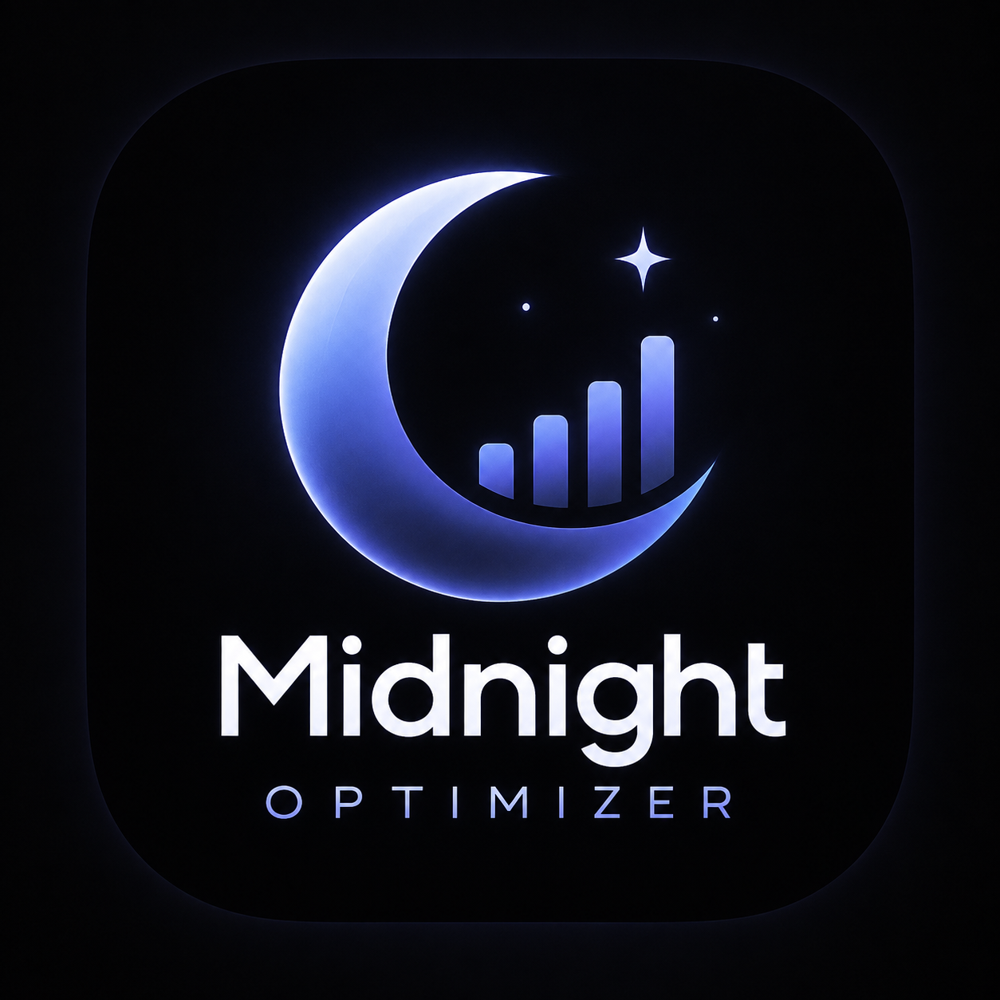

<p align="center">
  
</p>

# ⚡ Pulse Gaming Optimizer — Professional Esports Suite (v4.1)

Otimizador de alto desempenho e latência zero para Windows 10 e Windows 11, desenvolvido especificamente para jogadores competitivos (CS2, Valorant, Apex Legends, World of Warcraft, Call of Duty e outros).

[](https://github.com/chibangar/Otimiza-ao-de-jogos/releases)
[-0ea5e9?style=flat-square)](https://github.com/chibangar/Otimiza-ao-de-jogos)
[](LICENSE)

---

## ⚡ Destaques da Versão 4.1

- **Nova Identidade Visual & Logótipo Esports**: Marca oficial **Pulse Gaming Optimizer** com emblema eletrizante em escudo cibernético neon cyan e violeta.
- **Design System de Alta Performance (Dark HUD & Glassmorphism)**: Painéis translúcidos em vidro fumado escuro, gradientes de profundidade e bordas iluminadas a neon.
- **Reator Orbital no Dashboard**: Acionamento instantâneo do Modo Competitivo com anéis de aceleração de energia holográficos.
- **Telemetria Circular SVG**: 4 anéis dinâmicos de leitura em tempo real para processador (CPU), placa gráfica (GPU), memória RAM e disco.
- **Miras & Viewmodels CS2 v3.2**: Configurações dos melhores jogadores profissionais do mundo, códigos de partilha e renderizações in-game.
- **Microfone & Estúdio Virtual Pulse**: Modulador de voz e Soundboard com atalhos globais integrados ao Discord, Steam e CS2.
- **Compilação e Releases Automáticas**: GitHub Actions atualizado com distribuição contínua do executável `PulseOptimizer.exe`.

---

## 🛠️ Funcionalidades Principais

### 1. Centro de Controlo & Telemetria
- Leitura precisa de utilização de processador, placa gráfica, memória RAM e disco.
- Monitorização de taxa de quadros (FPS) e consistência de frametime (1% e 0.1% low).
- Ações rápidas de libertação de memória cache e flush DNS.

### 2. Modo Competitivo
Aplica num clique o conjunto de regras essenciais para menor latência de entrada (*input lag*):
- Plano de energia **Ultimate Performance** com throttling de CPU desativado.
- Priorização do processo de jogo no agendador do Windows.
- Otimização da pilha de rede TCP/IP (`SystemResponsiveness = 0`).
- Suspensão de processos secundários em segundo plano.

### 3. Otimizações de Sistema e Windows
- **Privacidade & Telemetria**: Desativação de serviços invasivos de diagnóstico e recolha de dados.
- **Debloat**: Remoção segura de aplicações pré-instaladas redundantes.
- **Gaming Extra**: Desativação da aceleração do rato no Windows e otimização de modo Fullscreen Exclusivo.
- **Energia Contínua**: Manutenção de alimentação em portas USB para periféricos de alta taxa de sondagem (1000Hz+).

### 4. Estúdio de Áudio & Soundboard
- Módulo de modulação de voz com microfone virtual dedicado **Pulse Mic**.
- Soundboard com suporte para atalhos globais de teclado (F1–F12, combinações).
- Integração direta com Discord, Steam e jogos multijogador.

---

## 📥 Como Descarregar e Executar

### Opção 1: Executável Pronto (Recomendado)
1. Aceda à página de [Releases do GitHub](https://github.com/chibangar/Otimiza-ao-de-jogos/releases).
2. Transfira o ficheiro `PulseOptimizer.exe` (ou `PulseOptimizer-Windows-x64.zip`).
3. Execute como **Administrador** para permitir a aplicação de planos de energia e ajustes de registo.

### Opção 2: A Partir do Código Fonte
Requisitos: Python 3.10+ (64-bit) no Windows.

```bash
# 1. Clonar o repositório
git clone https://github.com/chibangar/Otimiza-ao-de-jogos.git
cd Otimiza-ao-de-jogos

# 2. Instalar dependências
pip install -r requirements.txt

# 3. Iniciar a aplicação
iniciar.bat
# ou diretamente via Python:
python app.py
```

---

## 🚀 Publicação de Novas Versões

O repositório inclui um fluxo de trabalho automatizado em `.github/workflows/release.yml`. Sempre que uma nova tag Git (ex: `v3.1.0`) é enviada para o repositório, o GitHub Actions:
1. Configura o ambiente Windows de compilação.
2. Instala dependências e compila o ficheiro `MidnightOptimizer.exe` com PyInstaller.
3. Cria o ficheiro comprimido `MidnightOptimizer-Windows-x64.zip`.
4. Publica a nova Release no GitHub com as notas de versão e ficheiros para transferência.

Para publicar uma nova versão com 1 clique no terminal:
```powershell
.\publicar_versao.ps1 -Version "v3.1.0"
```

---

## 📄 Licença
Distribuído sob a licença MIT. Consulte o ficheiro [LICENSE](LICENSE) para mais detalhes.
